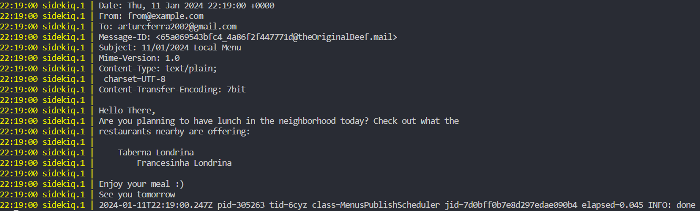

# Newsletter challenge

The objective of this challenge was implementing a website for a newsletter subscription.

## Users

*Local* 
- Subscribe to the local newsletter with email

*Owner*
- Create a new menu with the specific day specialities

## Stack

*Frontend:* 
- React + React-Bootstrap
*Backend:*
- Ruby on Rails

# Development

### Models

*subscriber*
- email :string

*menu*
- publish_date :date
- restaurant :string
- has_many :specialities

*speciality*
- name :string
- belongs_to :menu

### Backend

Since I'm not 100% familiar with Ruby on Rails I decided to start developing the mailer system first. I used sidekiq and sidekiq-scheduler gems to create a cron job and with Action Mailer created the requested mails with all the menus from the different restaurants. This process was quite fast, since I had implemented a quick draft the day before while searching for a solution, since I had not previously done something like this using Rails. There were doubts implementing the POST for a new menu, since I wanted to only do one API call, and in the formData I included the array of associated specialities. With a good tip I discovered *accepts_nested_attributes_for* and used it for that purpose. 

### Frontend

Next implementing the screens. 
I decided to create 3 diferent pages:
- HomePage for the subscriptions -> /
- NewSpecialitiesPage for the owners -> /specialities
- FeedbackPage for feeback confirmation -> /feedback
  
There were some minor complications during the setup, could not install TailwindCSS, so decided to use React-Bootstrap. However the main issue was the fetch with the formData, since I've never connected a rails API with a React frontend. I spent some time figuring it out, but ultimately was successfull. The design is not fully responsive, however it work in different screen sizes, because of the displayment in the screen.

## Future Work

The implementation is not perfect, far from it, there are several upgrades possible.
1. Implement tests for the backend using rspec and shoulda-matchers. Something that I've been searching recently and that would prevent mistakes.
2. Validation of the models parameters. such has the date could not be less than today's date.
3. Cleaning frontend and move some parts of the pages to components. HomePage is the one where that would be beneficial, but the others also, for instance in the forms.
4. Implement a different mail if there are no menus for the day.

## How to run

*Backend*
- Should have ruby and rails installed (I used asdf version manager)
- In the root directory of the project:
```
./bin/setup
./bin/dev
```

*Frontend*
- Should have npm installed (asdf)
- In **/client** directory
```
npm install
npm run dev
```

## Why did the mail not include the menus the during the presentation?

In my mail implementation I do not check if there are no users to send a mail to. The mail was created and the model updated, the publish was changed to true, however the user was not yet subscribed and no mail was sent. I tested it again with a user and had this output:



To fix this mistake in the menu_publish_scheduler a verification should be made to stop the job if there are no users. However in the final application the job runs every day at 10AM, if there are not users, I think the menus should be updated nontheless, because we do not want to send the menus from the day before the next day mail. This, however, could be a problem with the seleciton of the menus, a better query could be made to skip menus not needed.